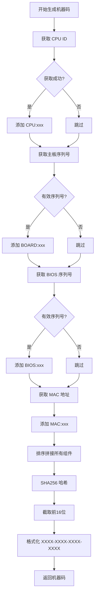
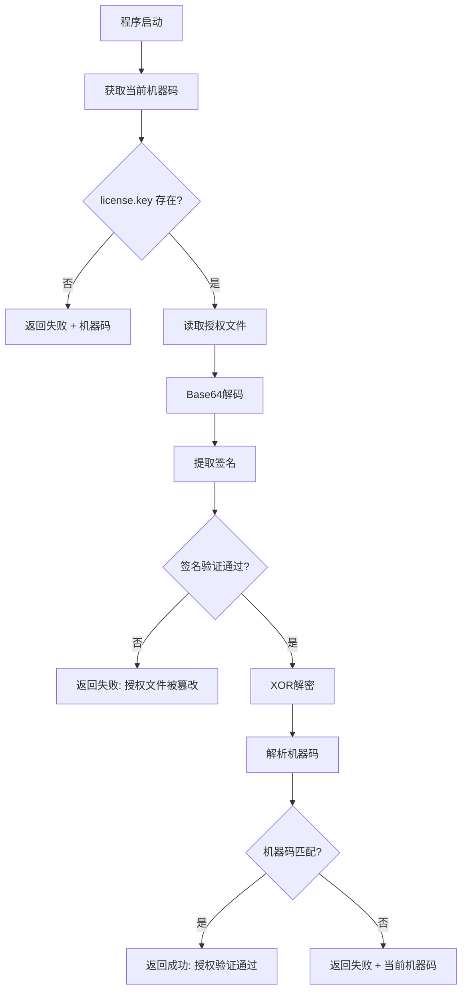
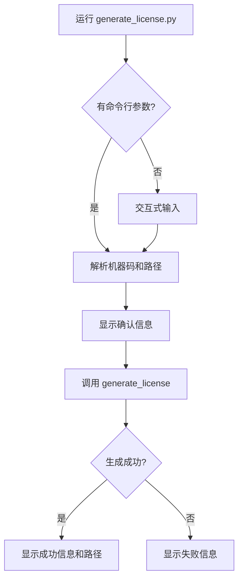

# RocoFlower 授权系统文档

## 一、系统架构概览

```
┌─────────────────────────────────────────────────────────────────────┐
│                        授权系统架构                                  │
├─────────────────────────────────────────────────────────────────────┤
│                                                                     │
│    ┌──────────────┐         ┌──────────────┐                       │
│    │   用户端     │         │   开发者端   │                       │
│    │              │         │              │                       │
│    │  ┌────────┐  │         │  ┌────────┐  │                       │
│    │  │auth.py │  │         │  │generate│  │                       │
│    │  │        │──┼────────►│  │_license│  │                       │
│    │  │机器码  │  │  发送   │  │.py     │  │                       │
│    │  │生成    │  │  机器码 │  │        │  │                       │
│    │  └────────┘  │         │  └────────┘  │                       │
│    │              │         │      │       │                       │
│    │  ┌────────┐  │         │      │       │                       │
│    │  │license │◄─┼─────────┼──────┘       │                       │
│    │  │.key    │  │  接收   │  生成授权    │                       │
│    │  │验证    │  │  授权   │  文件        │                       │
│    │  └────────┘  │         │              │                       │
│    └──────────────┘         └──────────────┘                       │
│                                                                     │
└─────────────────────────────────────────────────────────────────────┘
```

---

## 二、授权验证方式

### 2.1 机器码生成机制

#### 核心函数：`get_machine_id()`

```python
def get_machine_id() -> str:
    """
    获取机器唯一标识码。
    
    使用最稳定的硬件标识符：CPU、主板、BIOS、MAC地址。
    这些标识符在正常使用情况下不会变化。
    
    Returns:
        str: 16位机器码，格式如 "A1B2-C3D4-E5F6-G7H8"
    """
```

#### 硬件标识符采集流程



#### 采集的硬件信息

| 标识符 | 获取命令 | 过滤条件 |
|--------|---------|---------|
| CPU ID | `wmic cpu get ProcessorId` | 非空即可 |
| 主板序列号 | `wmic baseboard get SerialNumber` | 排除 DEFAULT/N/A/NONE |
| BIOS 序列号 | `wmic bios get SerialNumber` | 排除 DEFAULT/N/A/NONE |
| MAC 地址 | `uuid.getnode()` | 非空即可 |

#### 机器码生成算法

```
输入: CPU:BFEBFBFF000906EA | BOARD:CZC12345678 | BIOS:HP123456 | MAC:A1B2C3D4E5F6

步骤1: 排序拼接
       → "BIOS:HP123456|BOARD:CZC12345678|CPU:BFEBFBFF000906EA|MAC:A1B2C3D4E5F6"

步骤2: SHA256 哈希
       → "A1B2C3D4E5F6789012345678901234567890ABCDEF..."

步骤3: 截取前16位
       → "A1B2C3D4E5F67890"

步骤4: 格式化
       → "A1B2-C3D4-E5F6-7890"
```

---

### 2.2 授权文件结构

#### 文件格式

```
Base64编码内容(每行64字符)
+ HMAC-SHA256签名(16字符)
```

#### 授权内容编码流程

```mermaid
flowchart LR
    A[机器码|时间戳|应用ID] --> B[UTF-8编码]
    B --> C[XOR加密]
    C --> D[HMAC签名]
    D --> E[拼接签名]
    E --> F[Base64编码]
    F --> G[写入文件]
```

#### 授权文件示例

```
rO0ABXQABjEyMzQ1NhtA2B3C4D5E6F7A8B9C0D1E2F3A4B5C6D7E8F9A0B1C2D3E4F5A6B7
C8D9E0F1A2B3C4D5E6F7A8B9C0D1E2F3A4B5C6D7E8F9A0B1C2D3E4F5A6B7C8D9E0F1A2
B3C4D5E6F7A8B9C0D1E2F3A4B5C6D7E8F9A0B1C2D3E4F5A6B7C8D9E0F1A2B3C4D5E6F7
```

---

### 2.3 授权验证流程



#### 核心验证函数

```python
def check_license(license_file: str = "license.key") -> tuple:
    """
    检查授权文件是否有效。
    
    Args:
        license_file: 授权文件名
        
    Returns:
        tuple: (是否授权通过, 消息)
    """
```

#### 验证结果说明

| 返回值 | 含义 | 用户操作 |
|--------|------|---------|
| `(True, "授权验证通过")` | 授权有效 | 正常使用软件 |
| `(False, machine_id)` | 无授权文件/机器码不匹配 | 发送机器码给开发者 |
| `(False, "授权文件已被篡改")` | 授权文件被修改 | 重新获取授权文件 |
| `(False, "授权文件不匹配")` | 授权文件非本软件 | 使用正确的授权文件 |

---

## 三、授权分发方式

### 3.1 开发者工具：generate_license.py

#### 使用方式

**方式一：交互式输入**
```bash
python generate_license.py
```

**方式二：命令行参数**
```bash
python generate_license.py A1B2-C3D4-E5F6-G7H8
python generate_license.py A1B2-C3D4-E5F6-G7H8 custom_path.lic
```

#### 执行流程



#### 输出示例

```
==================================================
  RocoFlower 授权文件生成工具
==================================================

机器码: A1B2-C3D4-E5F6-G7H8
输出路径: license.key

[成功] 授权文件已生成!
[路径] D:\Projects\RocoFlower\license.key

请将 license.key 文件发送给用户，放置在程序同目录下即可使用。
```

---

### 3.2 授权分发流程

```
┌─────────────────────────────────────────────────────────────────────┐
│                        授权分发流程                                  │
├─────────────────────────────────────────────────────────────────────┤
│                                                                     │
│  用户                              开发者                           │
│   │                                  │                             │
│   │  1. 运行软件获取机器码           │                             │
│   │  ─────────────────────────────►  │                             │
│   │                                  │                             │
│   │  2. 发送机器码给开发者           │                             │
│   │  ─────────────────────────────►  │                             │
│   │                                  │  3. 运行 generate_license   │
│   │                                  │     生成 license.key        │
│   │                                  │                             │
│   │  4. 接收授权文件                 │                             │
│   │  ◄─────────────────────────────  │                             │
│   │                                  │                             │
│   │  5. 将 license.key 放入程序目录  │                             │
│   │                                  │                             │
│   │  6. 重新运行软件，验证通过       │                             │
│   │                                  │                             │
│                                                                     │
└─────────────────────────────────────────────────────────────────────┘
```

---

## 四、用户验证授权方式

### 4.1 获取机器码

#### 方法一：程序启动时自动显示

当程序检测到无有效授权时，会显示机器码：

```
┌────────────────────────────────────────┐
│           授权验证失败                 │
├────────────────────────────────────────┤
│                                        │
│  您的机器码: A1B2-C3D4-E5F6-G7H8      │
│                                        │
│  请将此机器码发送给开发者获取授权      │
│                                        │
└────────────────────────────────────────┘
```

#### 方法二：直接运行 auth.py

```bash
python auth.py
```

输出：
```
========================================
  机器码授权工具
========================================

当前机器码: A1B2-C3D4-E5F6-G7H8
```

---

### 4.2 安装授权文件

#### 步骤

1. 将收到的 `license.key` 文件复制到程序所在目录
2. 重新启动程序

#### 目录结构

```
RocoFlower/
├── RocoFlower.exe      # 主程序
├── license.key         # 授权文件 ← 放在这里
├── auth.py             # 授权模块
└── ...
```

---

### 4.3 验证结果

| 场景 | 程序行为 |
|------|---------|
| 授权有效 | 正常启动，显示主界面 |
| 无授权文件 | 显示机器码，提示联系开发者 |
| 机器码不匹配 | 显示当前机器码，提示重新获取授权 |
| 授权文件损坏 | 提示授权文件无效，重新获取 |

---

## 五、安全机制

### 5.1 加密方案

| 项目 | 方案 | 说明 |
|------|------|------|
| 数据加密 | XOR + SECRET_KEY | 防止明文查看 |
| 签名验证 | HMAC-SHA256 | 防止篡改 |
| 密钥管理 | 内置常量 | 编译后不易提取 |

### 5.2 防护措施

```
┌─────────────────────────────────────────────────────────────────────┐
│                        安全防护层次                                  │
├─────────────────────────────────────────────────────────────────────┤
│                                                                     │
│  第1层: 文件存在性检查                                              │
│         └─► 无授权文件直接拒绝                                      │
│                                                                     │
│  第2层: Base64 格式验证                                             │
│         └─► 格式错误拒绝                                            │
│                                                                     │
│  第3层: HMAC 签名验证                                               │
│         └─► 签名不匹配拒绝（防篡改）                                │
│                                                                     │
│  第4层: 应用ID验证                                                  │
│         └─► 非本软件授权拒绝                                        │
│                                                                     │
│  第5层: 机器码匹配验证                                              │
│         └─► 机器码不匹配拒绝                                        │
│                                                                     │
└─────────────────────────────────────────────────────────────────────┘
```

---

## 六、已知问题与改进建议

### 6.1 当前问题

| 问题 | 影响 | 原因 |
|------|------|------|
| MAC 地址不稳定 | 机器码变化 | 虚拟网卡/网卡切换导致顺序改变 |
| WMIC 已弃用 | Windows 11 兼容性 | 微软已弃用 WMIC |
| 无效值过滤不全 | 机器码不稳定 | 部分主板返回占位符 |
| 无容错机制 | 用户体验差 | 任一组件变化即失效 |

### 6.2 改进建议

1. **MAC 地址获取优化**：排除虚拟网卡，使用物理网卡
2. **命令替换**：使用 PowerShell 替代 WMIC
3. **容错匹配**：多组件部分匹配即可通过
4. **无效值完善**：增加更多占位符过滤

---

## 七、文件清单

| 文件 | 用途 | 使用者 |
|------|------|--------|
| `auth.py` | 授权验证核心模块 | 用户端 + 开发者端 |
| `generate_license.py` | 授权文件生成工具 | 开发者端 |
| `license.key` | 授权文件 | 用户端 |

---

## 八、快速参考

### 开发者命令

```bash
# 生成授权文件
python generate_license.py <机器码> [输出路径]

# 查看本机机器码
python auth.py
```

### 用户操作

1. 运行程序获取机器码
2. 发送机器码给开发者
3. 接收 `license.key` 文件
4. 放入程序目录
5. 重新运行程序
